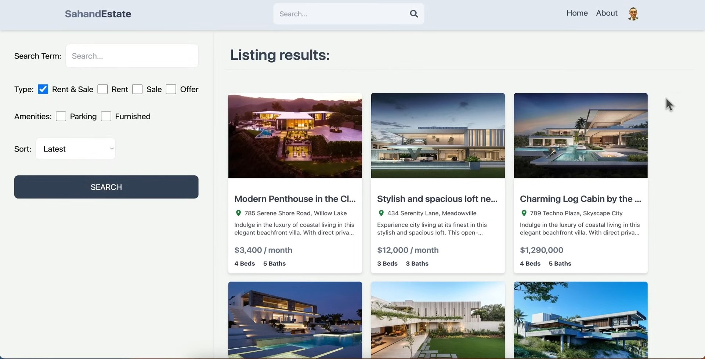
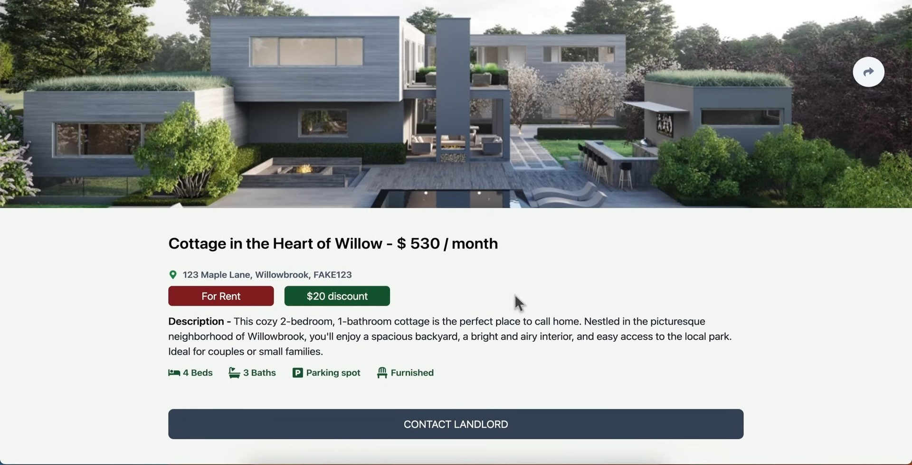
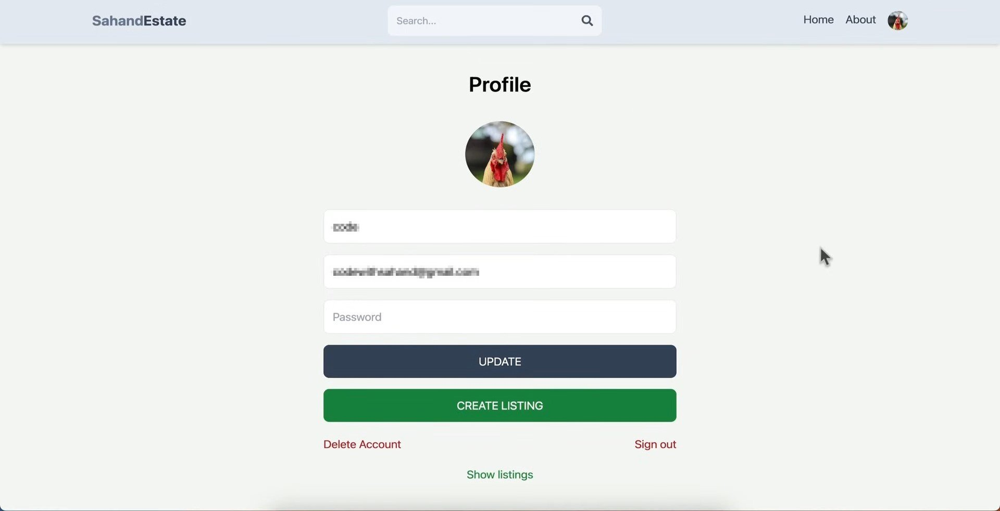
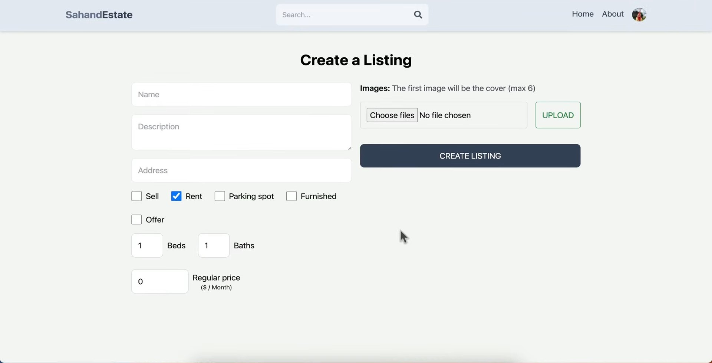
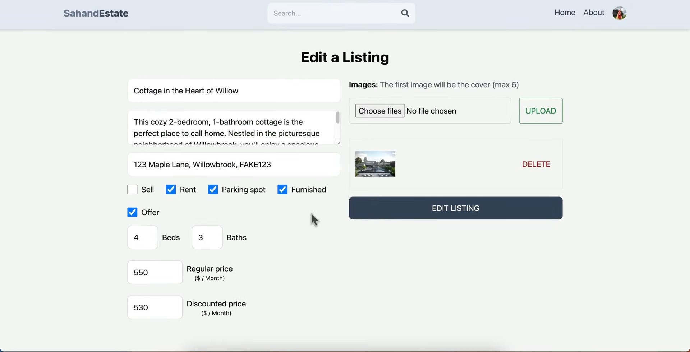
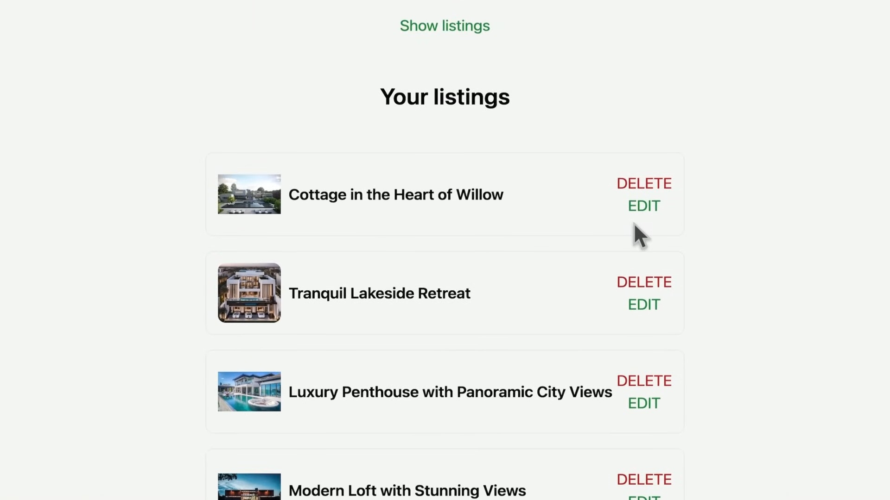
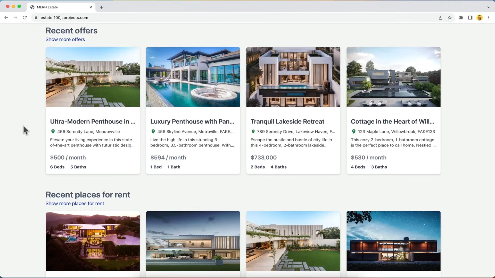

  
  

  
  

  
  

  

## 📚 Introduction

SahandEstate is a full-stack real estate platform designed to facilitate seamless property listings, user management, and interactive features for both buyers and sellers. Built with the latest web technologies, this project offers a smooth and intuitive user experience for registering, signing in, updating profiles, listing properties, and browsing available real estate offers.  
The platform leverages a modern tech stack including React, Node.js, MongoDB, and Firebase for authentication and file storage. With integrated payment processing via Stripe, users can securely purchase and manage their listings. Additionally, the platform features an admin dashboard for managing user activities and property listings, making it a comprehensive solution for real estate transactions.

- 🔑 **Advanced Authentication**: Implement JWT, Firebase, and Google OAuth for secure and seamless user access.  
- 🏡 **Real-world CRUD Operations**: Create, read, update, and delete property listings using MongoDB.  
- 💡 **User-friendly Features**: Enhance the user experience with image uploads, property listing management, and more.  
- 🚀 **Advanced Search Functionality**: Implement cutting-edge search features to help users find what they're looking for.  

---

## ⚙️ Tech Used

  
  
  
  
  
  
  

---

## 🔋 Features

### 1. **User Registration & Profile Management**  
Seamless user authentication and account management system powered by **Firebase**, allowing users to create, update, and manage their personal profiles.

### 2. **Property Listings Management**  
Users can effortlessly **browse**, **add**, **edit**, and **delete** property listings. Property details include **high-quality images**, **price**, **location**, **description**, and **amenities**.

### 3. **Integrated Search & Filters**  
Advanced search functionality with **filters** based on property type, **price range**, **location**, and more, providing users with a tailored property discovery experience.

### 4. **Real-Time Data Updates**  
Live property updates, including **price changes**, **availability**, and **listing status**. Users can view real-time changes to listings and transactions.

### 5. **Admin Dashboard**  
A robust **admin panel** for managing user accounts, property listings, and monitoring transactions. Admins can **approve**, **reject**, or **edit** listings and view user activity in real-time.

### 6. **Responsive Design**  
Fully responsive, mobile-first design using **Tailwind CSS**, ensuring an optimal viewing experience across a wide range of devices, from smartphones to desktops.

### 7. **Interactive Map View**  
Visual property location display with an integrated **map** for users to easily explore properties in specific areas or neighborhoods.

### 8. **User Reviews & Ratings**  
Allows users to leave **reviews** and **ratings** for properties, enhancing trust and providing feedback for other potential buyers or renters.

### 9. **File Uploads with Firebase**  
Simple and secure file upload system for users to add property images, floor plans, and other documents related to their listings using **Firebase Storage**.

### 10. **Notifications & Alerts**  
Real-time **email** and **in-app notifications** to inform users about listing status updates, new messages, or changes in the property they are interested in.

### 11. **Advanced Analytics**  
Track user behavior and property performance with detailed **analytics** on views, interactions, and purchases, helping sellers optimize their listings.

### 12. **Secure User Authentication**  
Utilizes **Firebase Authentication** for robust security, ensuring a secure sign-in and user verification process.

### 13. **Scalable Infrastructure**  
Built with scalability in mind, the platform is designed to handle growing user bases and increasing traffic, powered by **Node.js** and **MongoDB**.

---

## ⚙️ Planned Optimizations

- **Performance Improvements**: Implement lazy loading and code splitting to enhance load times and user experience.

- **Search Enhancement**: Integrate full-text search for more efficient property discovery based on multiple criteria.

- **Scalable Backend**: Migrate to a microservices architecture with **Node.js** to improve scalability and service management.

- **Advanced Caching**: Use **Redis** for caching popular property listings, reducing server load and improving page speed.

- **Real-Time Notifications**: Implement push notifications for instant updates on property status and offers.

---

## 📚 Lessons Learned

- **User-Centric Design**: Prioritizing an intuitive, user-friendly interface significantly improves user engagement and satisfaction.

- **Scalability Challenges**: Early consideration of scaling the backend for increasing traffic helps avoid bottlenecks and performance issues down the line.

- **Integration Complexity**: Ensuring seamless integration with third-party services like **Stripe** and **Firebase** requires meticulous attention to detail to prevent issues with payments and authentication.
